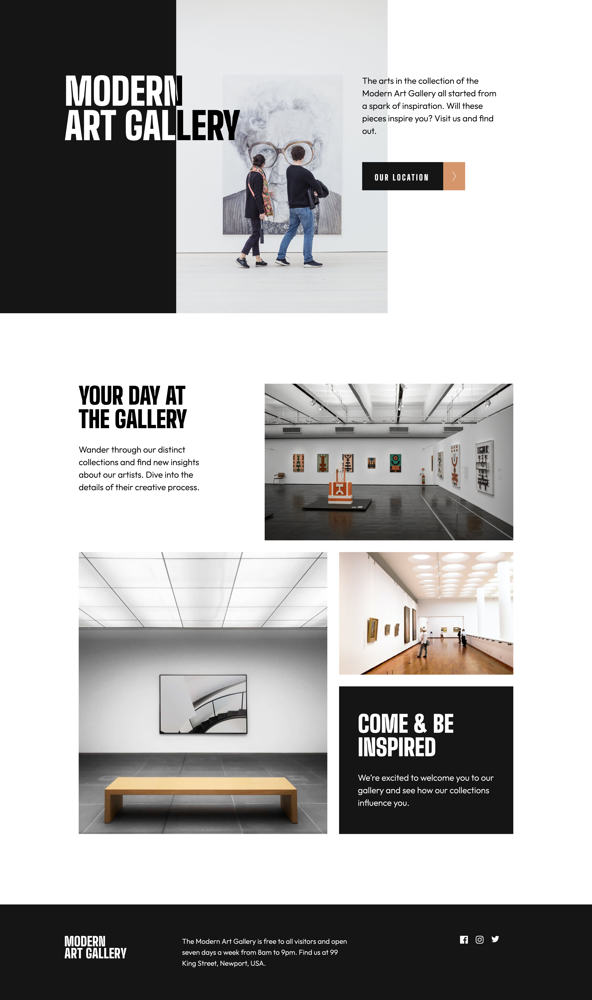
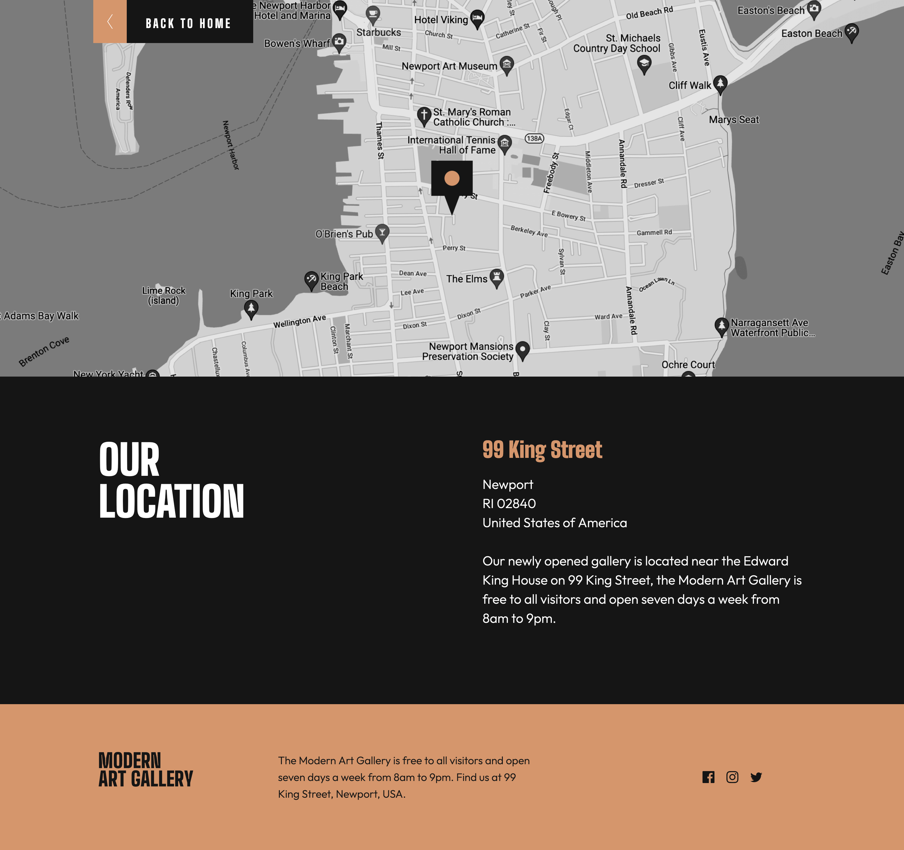

# Frontend Mentor - Art gallery website solution

This is a solution to the [Art gallery website challenge on Frontend Mentor](https://www.frontendmentor.io/challenges/art-gallery-website-yVdrZlxyA). Frontend Mentor challenges help you improve your coding skills by building realistic projects.

## Table of contents

- [Frontend Mentor - Art gallery website solution](#frontend-mentor---art-gallery-website-solution)
  - [Table of contents](#table-of-contents)
  - [Overview](#overview)
    - [The challenge](#the-challenge)
    - [Screenshot](#screenshot)
    - [Links](#links)
  - [My process](#my-process)
    - [Built with](#built-with)
    - [What I learned](#what-i-learned)
  - [Author](#author)
  - [Acknowledgments](#acknowledgments)

## Overview

### The challenge

Users should be able to:

- View the optimal layout for each page depending on their device's screen size
- See hover states for all interactive elements throughout the site
- **Bonus**: Use [Leaflet JS](https://leafletjs.com/) to create an interactive location map with custom location pin

### Screenshot

### Links

- Solution URL: [GitHub Solution](https://github.com/ogbechie04/Art_Gallery)
- Live Site URL: [Art Gallery]( https://art-gallery-weld.vercel.app/index.html)

## My process

### Built with

- Semantic HTML5 markup
- CSS custom properties
- Flexbox
- CSS Grid
- Media Queries

### What I learned

- I learned more on how to use grid.
- I further improved my responsive webpage layout.

## Author

- Website - [Laura Ogbechie](https://vercel.com/ogbechie04s-projects)
- Frontend Mentor - [@ogbechie04](https://www.frontendmentor.io/profile/ogbechie04)
- Twitter - [@ogbechie_04](https://twitter.com/ogbechie_04)
